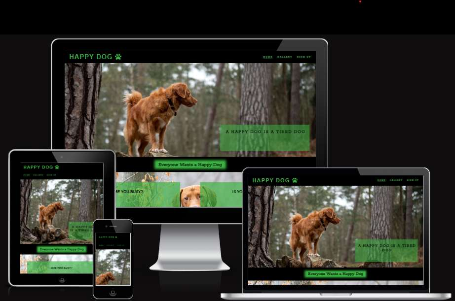
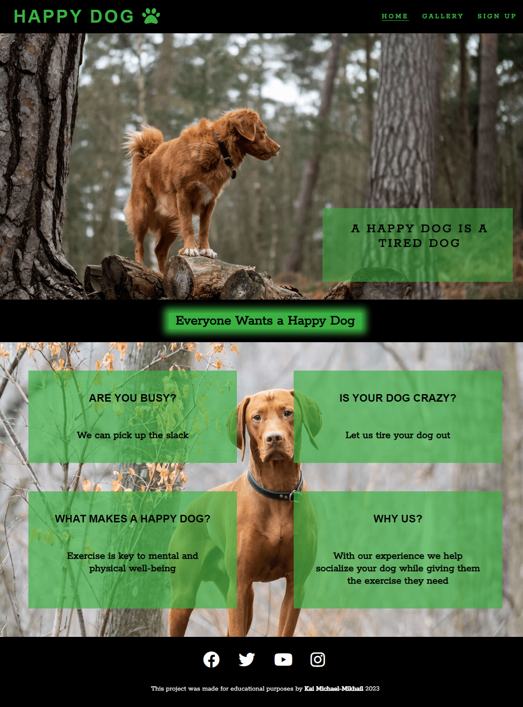
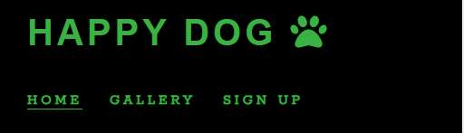
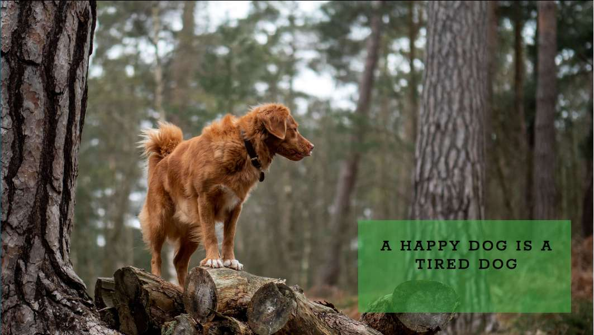
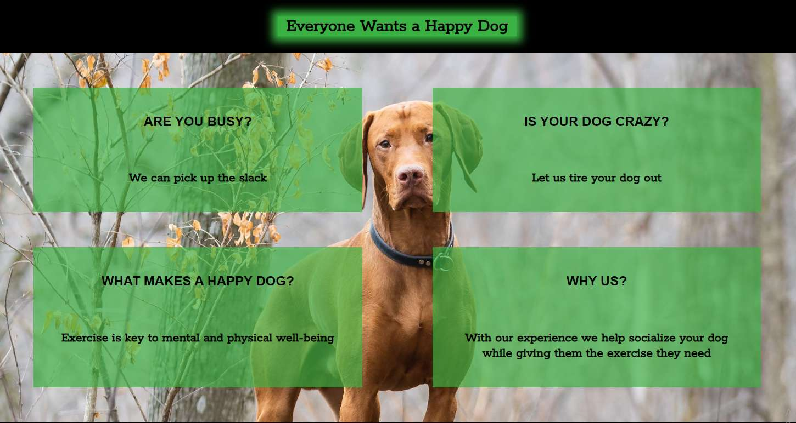
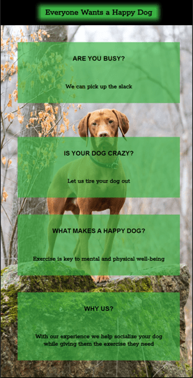
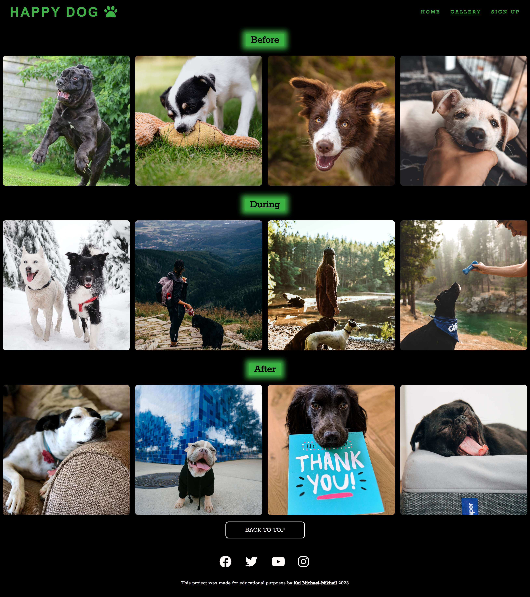
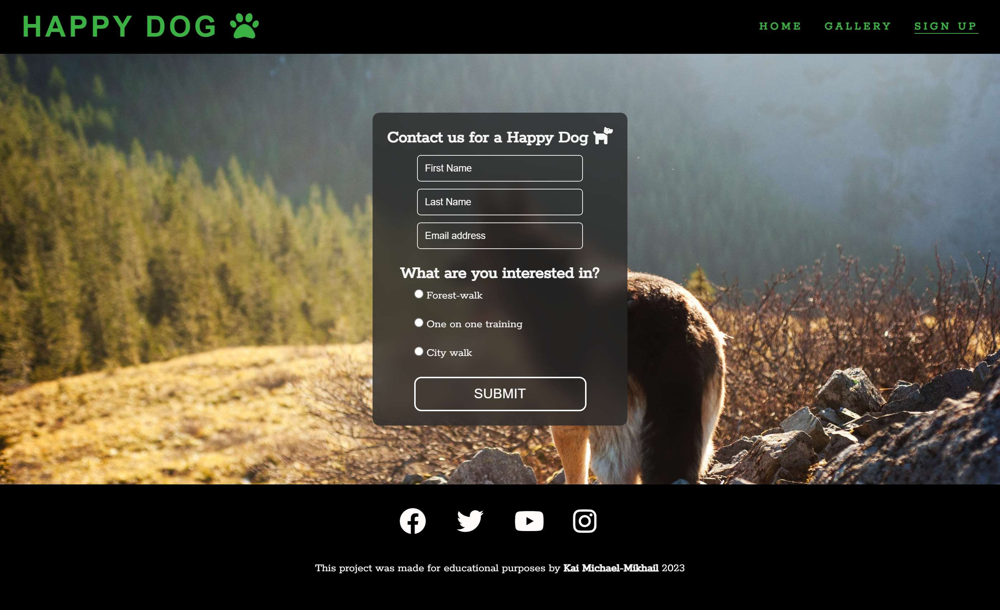
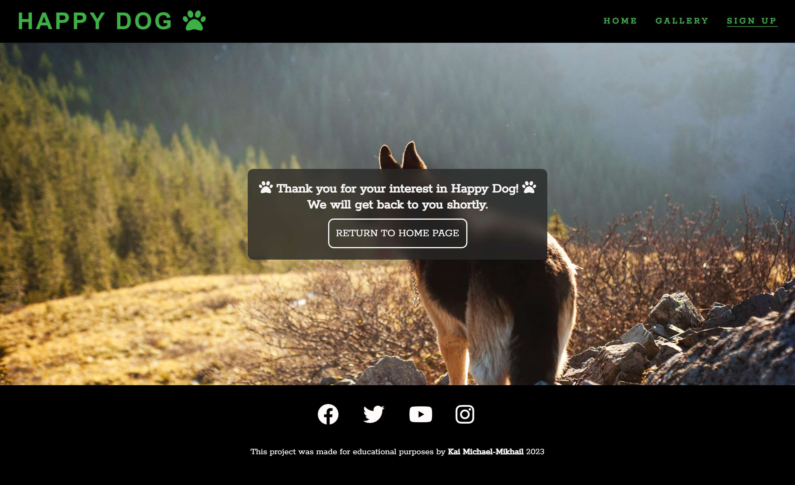

# _Happy Dog_

[Am I Responsive link](https://ui.dev/amiresponsive?url=https://dekeypetey40.github.io/Happy-Dog-Website/)

---

# Table Of Contents

- [Introduction](#introduction)
- [Technologies Used](#technologies-used)
- [User Stories](#user-stories)
- [Design](#design)
  * [Wireframes](#wireframes)
- [Features](#features)
  * [Home Page](#home-page)
    + [Navigation Bar](#navigation)
    + [Hero Section](#hero-section)
    + [Ethos Section](#ethos-section)
    + [Footer](#footer)
    + [Gallery](#gallery-page)
    + [Sign Up Page](#sign-up-page)
- [Future Features](#future-features)
- [Testing](#testing)
  * [Validator Testing](validator-testing)
  * [Bugs](#bugs)
  * [Solved Bugs](#solved-bugs)
  * [Manual Testing](#manual-testing)
- [Deployment](#deployment)
- [Credits](#credits)
  * [Content](#content)
  * [Media](#media)

---
# Introduction

[Happy Dog](https://dekeypetey40.github.io/Happy-Dog-Website/) is a website for a dog walking service.

Potential clients can get basic information about why Happy Dog is a good service, see pictures of dogs out on walks, and sign up for the service. 

## Technologies used
- HTML
- CSS
- Font Awesome icons
- Google fonts 
- VSCode was the main editor used to write my code
- Balsamiq was used to make wireframes in the design process

---

## User stories
- As a first time visitor, I want to get an idea of what benefit the service provides.
- As a first time visitor, I want the website to be easy to navigate, so I can find what I am looking for. 
- As a first time visitor, I want to see what will Happy Dog will do with my dog.
- As a user, I want to easily to be able to sign up for the service and indicate which service I am interested in. 
- As a user, I want to be able to see who made the website and see their GitHub repository
- As a user, I want social media links to interact with the company there. I want them to be intuitive and easy to use. 
- As a mobile device user, I want to interact with a responsive website, so that I can visit it with any device.

---

# Design 

The website is designed as four separate pages to minimize the amount of scrolling required to find the information one is looking for. The main priorities is to present the benefits of the service and give potential customers the feeling that if they use this service their dogs will become overall happier. 

The gallery page on mobile screens becomes quite long so a back to top button was installed to prevent the user having to scroll back up to the top of the page. 

The usage of green on this website was to evoke nature. The website assumes dog owners will have more positive feelings if they think their dogs are running around outside.

## Wireframes

Wireframes were used in the beggining stages of the design phase. 
[Link to wireframe images](https://github.com/Dekeypetey40/Happy-Dog-Website/tree/main/wireframes) 

# Features

## Home page

- ### Navigation
- Positioned at the top of the page.
- The logo is located in the top left corner.
- In the top right corner there are navigation links.
  - Home link leads to the home page.
  - Gallery link leads to the gallery page.
  - Sign up link leads to the sign up page.
- The link belonging to the page the user is on is underlined.
- The link that the user hovers over is underlined.
- The navigation is simple, clear, and easy to use.
- The navigation bar is responsive on all screen sizes. 

 

---

- ### Hero section
  - Hero section has an animated background image.
  - Hero section has a text block on top of the background image with a transparant box.
  - It includes a slogan that contains the company name.

   <!-- FIX THIS -->
---

- ### Ethos section
  - The ethos section contains a background image that is responsive to all screen sizes.
  - It contains four sections with transparant backgrounds.
  - It promotes the benefits of the service.
    
    
---

- ### Footer
  - The footer contains social media links that open in a new tab.
  - Under the social media links there is a text describing the purpose of the website and a link to my github page. 
    

---

- ## Gallery page

  - Contains pictures of how dogs are before, during, and after using the service.
  - The gallery is broken up into three sections with four images each. 
  - The gallery page is responsive to all screen sizes.
    - On a desktop screen there are three rows of four images.
    - On a smaller screen there are six rows with two images each.
    - On mobile screens there is one column with twelve images. 

      
      [Gallery page on smaller screens](https://github.com/Dekeypetey40/Happy-Dog-Website/tree/main/galleryreadme)

- ## Sign Up page

  - This page has a sign up form
    - All text input fields are styled and interactive when hovering over them.
    - The radio buttons have spacing between them. 
    - The submit button is styled and is interactive when hovering over it. 
    - The page responds to all screen sizes. 
    - Upon submitting the form the user is taken to a thank you page styled in a similar manner.

       
      
---

# Future Features
  - A services offered page with listed prices for each service.
  - A meet the trainers/dog walker page.

# Testing
  - I tested to make sure the website works in the following browsers: Firefox, Chrome and Edge. 
  - I used Chrome's devtools and [Am I Responsive](https://ui.dev/amiresponsive) to check that the stylings respond and everything functions on all screen sizes. 
  - I tested every button and link to confirm that they work and lead where they are supposed to. 

## Validator testing
* [HTML Validator](https://validator.w3.org/) was run. Some small syntax errors were identified and fixed. After that no errors or warnings were shown. 
* [CSS Validator](https://validator.w3.org/) was run and no errors were found, but some minor warnings were attended to. At the time of submission the css code successfully passed the validator with no errors and only minor warnings. 
* Lighthouse in Chrome Developer Tools was used. There were some issues with performance and accessibility. Color choices were changed to to address accessibility and image files were compressed to improve performance. No other errors were found.

Lighthouse screenshot <!-- FIX THIS -->

## Bugs

## Solved bugs
  - My ethos section on the homepage became unresponsive to different screen sizes.
    - I solved it by realizing I had inputted the incorrect id in my media query.
  - My background image was not appearing on my github page version of the site.
    - This was solved by inputting a relative filepath to the image.
  - My logo was underlining when it should not on all pages except the index.html. 
    - I realized I had forgotten to put an id on the a element for my sign up, gallery, and response pages. 
  - My performance on my website was not optimal.
    - I solved this by compressing all of my image files. 
  - My backgrounds on my homepage where getting cropped on the right side on mobile screens.
    - My footer was wider than the container for the rest of the page so I shrunk my footer to the same width. 
  - My images looked warped at certain screen widths. When I fixed that problem they became cropped in an unappealing way.
    - I fixed this by shrinking the width of the entire gallery section at certain screen sizes. 

  ***
## Unsolved bugs

## Manual Testing

| feature | action | expected result | tested | passed | comments |
| --- | --- | --- | --- | --- | --- |
| Navbar | | | | | |
| Logo |Click on the logo |The user is directed to the home page |yes |yes | |
| Home | Click on the "Home" link | The user is directed to the main page | Yes | Yes | - |
| Gallery | Click on the "Gallery" link | The user is directed to the gallery page | Yes | Yes | - |
| Sign Up | Click on the "Sign up" link | The user is directed to the sign up page | Yes | Yes | - |
| Footer | | | | | |
| Instagram icon in the footer | Click on the Instagram icon | The user is directed to the Instagram page | Yes | Yes | - |
| Facebook icon in the footer | Click on the Facebook icon | The user is directed to the Facebook page | Yes | Yes | - |
| Twitter icon in the footer | Click on the Twitter icon | The user is directed to the Twitter page | Yes | Yes | - |
| YouTube icon in the footer | Click on the YouTube icon | The user is directed to the YouTube page | Yes | Yes | - |
| Home page | | | | | |
| Gallery page | | | | | |
| Back to top button | Click on the back to top button  | The user is directed to the top of the gallery page | yes | yes | |
| Sign Up page | | | | | |
| First name input | Enter text | Text is entered | Yes | Yes | If user doesn't enter any text an error message appears |
| Last name input | Enter text | Text is entered | Yes | Yes | If user doesn't enter any text an error message appears |
| Email input | Enter email | Email is entered | Yes | Yes | If user doesn't enter email an error message appears. If user enters an invalid email, the error message appears |
| Choose a service checkbox | Click on the checkbox | The checkbox is checked | Yes | Yes | If user does not check a box an error message appears |
| "Submit" button | Click on the "Submit" button | The user is redirected to the response page | Yes | Yes | - |
| Response page | | | | | |
| Return to home button | Click on the return to home page link | The user is redirected to the home page | Yes | Yes | - |

---

# Deployment
The site was deployed to GitHub pages. The following steps were taken to do so:
1. Log in to [Github](https://github.com/)
2. Navigate to [dekeypetey40/Happy-Dog-Website](https://github.com/Dekeypetey40/Happy-Dog-Website) in the list of repositories
3. In the GitHub repository, navigate to the [Settings](https://github.com/Dekeypetey40/Happy-Dog-Website/settings) tab
4. In Settings select [Pages](https://github.com/Dekeypetey40/Happy-Dog-Website/settings/pages) on the left hand menu.
5. From the source section drop-down menu, select the main branch.
6. Once the main branch has been selected, click on the save button in the branch section. Wait for the link to be generated and then refresh the page.

---

# Credits

## Content
  - Code for social media footer was taken from Code Institute's Love Running project and was adapted to suit my website. 
  - Section header and gallery styling was inspired by my mentor's (Aleksei Konovalov) Starlight English website: [Link to Starlight English](https://lexach91.github.io/esl-school-website/index.html)
  - I took code from w3schools to color my placeholders and to have it function on all browsers.
  - I learned how to use flexbox thanks to Kevin Powell's videos on youtube. [Link to Kevin Powell's youtube channel](https://www.youtube.com/@KevinPowell)
  - I used Siobhan Gorman's [Sourdough Bakes](https://github.com/siobhanlgorman/Sourdough-Bakes/blob/master/README.md), Aleksei Konovalov's [Starlight English](https://github.com/lexach91/esl-school-website/blob/main/README.md) and Luliia Konovalova's [Animal Shelter](https://github.com/IuliiaKonovalova/animal_shelter/blob/main/README.md) as inspiration for my own readme. 
 
 
## Media
  - Icon for my website was taken from
    -<a href="https://www.flaticon.com/free-icons/dog" title="dog icons">Dog icons created by Freepik - Flaticon</a>

  - Hero and ethos section photos taken from unsplash:
    - Hero photo by Jamie Street 
    - Ethos background photo by Cole Wyland
  - Gallery photos:
    - Mastiff photo taken from pixabay
    - Taken from Pexels:
      - Biting puppy (Guilherme Stecanella)
      - Brown and white dog with ears standing up(Jan Kopczyński)
      - Black and white dog biting a toy (Karolina Grabowska)
    - Taken from Unsplash:
      - Two dogs and a woman by a lake and dog looking at toy (Chewy)
      - Two dogs in the snow (Tadeusz Lakota)
      - A woman and her dog on a hike (Marcin Jozwiak)
      - Dog sleeping on a couch (Curtis Thornton)
      - Dog in hoodie (Karen Winegeart)
      - Black dog with thank you card (Howie R)
      - Yawning pug (charlesdeluvio)
  
---

